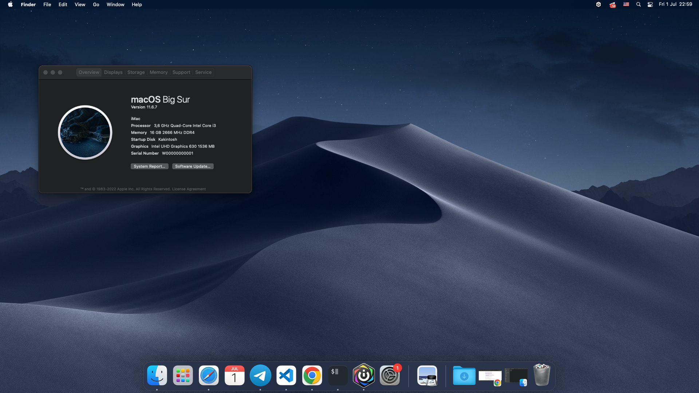

# PRIME-H410M-R-Hackintosh
ASUS PRIME H410M-R Hackintosh opencore config.

### **My specs**
* #### **CPU:** Intel Core I3 10100
* #### **Motherboard:** Asus Prime H410M-R
* #### **GPU:** Intel UHD Graphics 630
* #### **Opencore:** 0.8.1
 
  
### **Work:**
* [x] Booted

* [x] Internet Connection
* [x] Audio
* [x] Map Usb(But I not sure that is the right map.)

### **Need to do:**
- ####  ~~Map Usb~~
- #### ~~Fix sound~~
- ####  Make all SSDT by manual method
- * [x] SSDT-PLUG
- #### Fix RTC (resolve RTC/CMOS/safe-mode reboot issues.)
- #### Anything else...